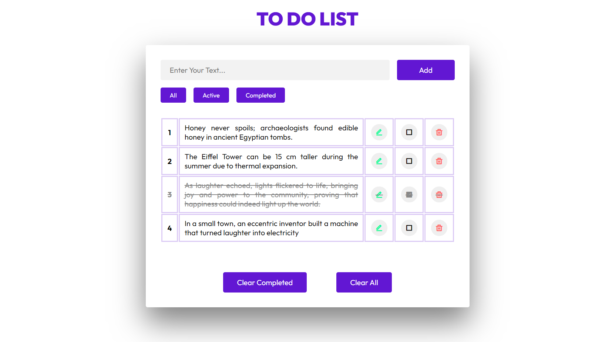
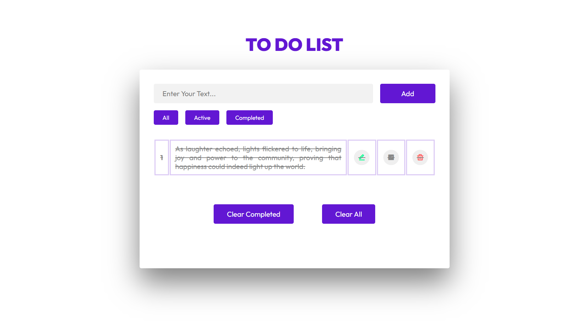
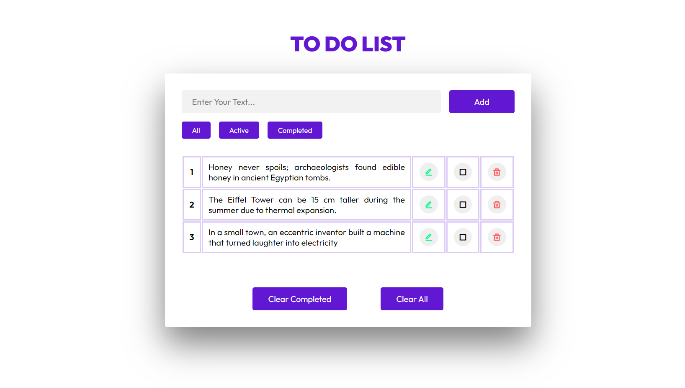

# React To-Do List

Welcome to the React To-Do List repository! This project is a React-based web application designed to help users manage their tasks effectively. Built with React, it features state management using `useState`, modular components for better organization, and a modern UI design for an intuitive and user-friendly experience. The app allows users to add, edit, delete, and check off tasks, with the ability to filter tasks based on their status (All, Active, Completed).

## Preview

### 1. Add Task (Edit, Delete, and Check)



### 2. Categories of All, Active, and Completed



### 3. Clear All or Clear Completed



## Features

- **Add Tasks:** Easily add new tasks with options to edit, delete, and check them off.
- **Filter Tasks:** View tasks based on categories (All, Active, Completed).
- **Clear Tasks:** Remove all tasks or clear completed tasks with a single click.
- **Modern UI Design:** Sleek layout and visually appealing design for an enjoyable user interface.

## Getting Started

To run the React To-Do List locally, follow these steps:

1. Clone the repository to your local machine:

   ```bash
   git clone https://github.com/Devsethi3/React-To-Do-List.git
   ```

2. Navigate to the project directory:

   ```bash
   cd react-to-do-list
   ```

3. Install the dependencies:

   ```bash
   npm install
   ```

4. Start the development server:

   ```bash
   npm start
   ```

5. Open your web browser and visit [http://localhost:3000](http://localhost:3000) to use the app.

## Usage

1. Enter a task in the input field and click "Add" to add a new task.
2. Hover over a task to reveal options for editing, deleting, and checking off the task.
3. Use the filter buttons to view tasks based on their status (All, Active, Completed).
4. Click "Clear All" to remove all tasks or "Clear Completed" to remove completed tasks.

## Customization

Feel free to customize this project to fit your preferences. Update styles, colors, and layout in the React components and CSS files. You can also extend the functionality to include additional features or customization options.

## Contributing

If you'd like to contribute to this project, please follow these steps:

1. Fork the repository.
2. Create a new branch for your feature or improvement.
3. Make your changes and commit them with descriptive messages.
4. Push your changes to your forked repository.
5. Open a pull request to merge your changes into the main branch.

Explore the React To-Do List, stay organized, and consider contributing to its development. Thank you for checking out the repository!